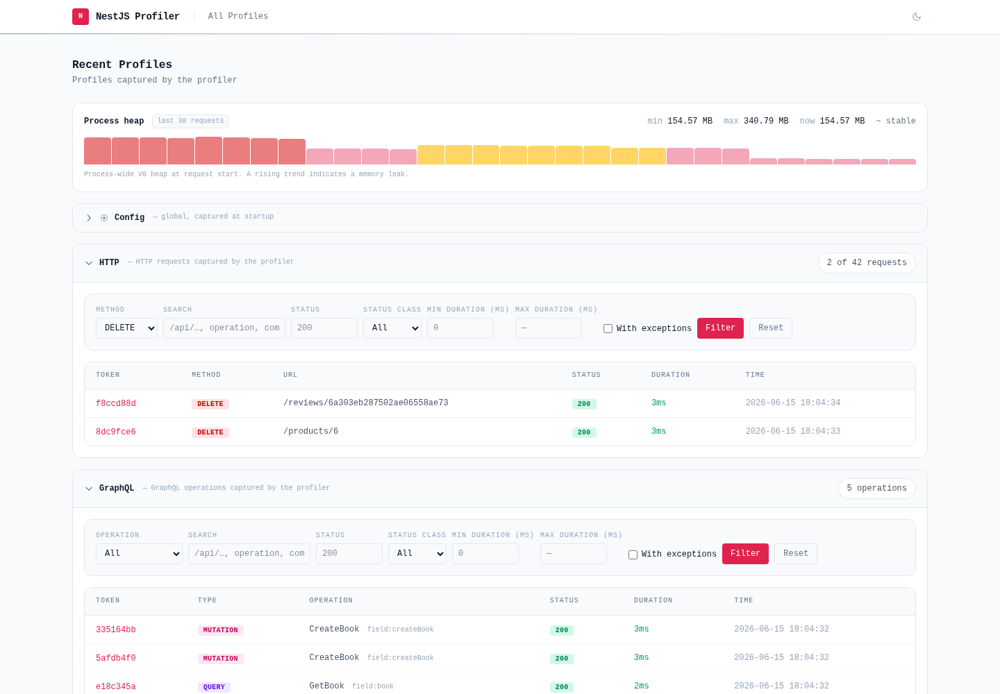
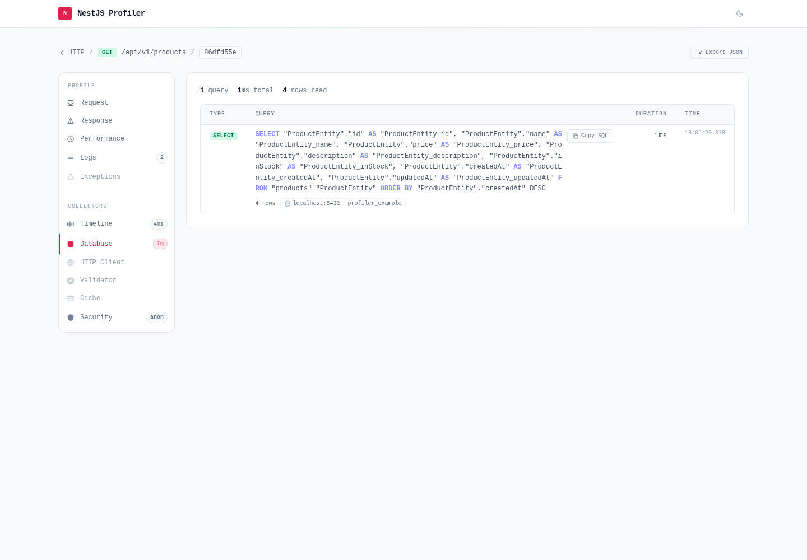
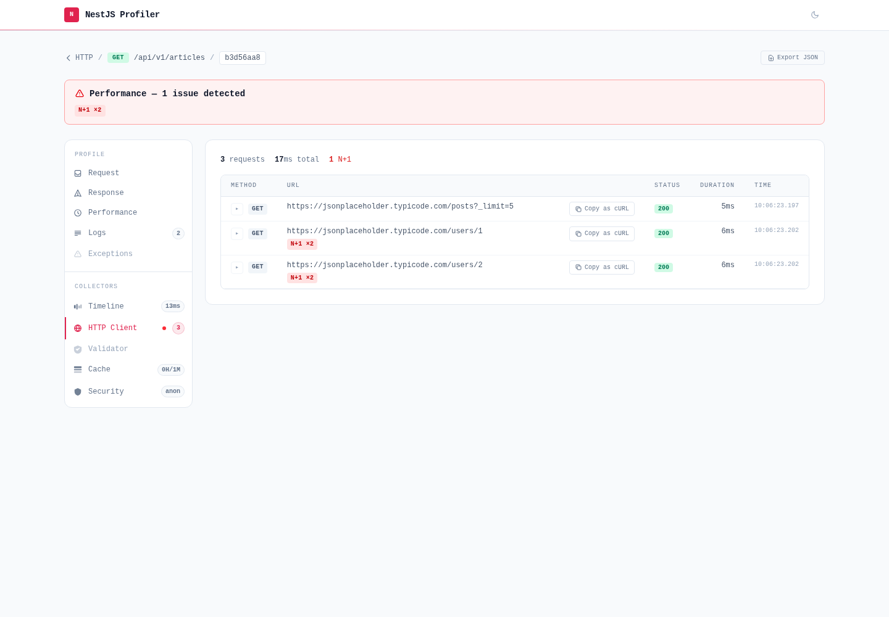
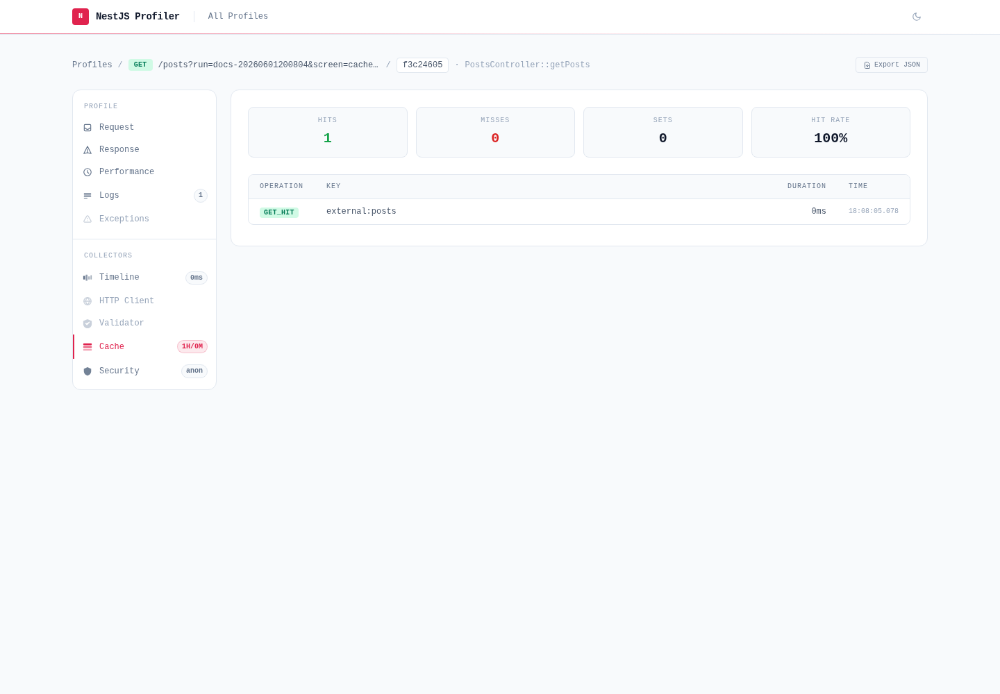
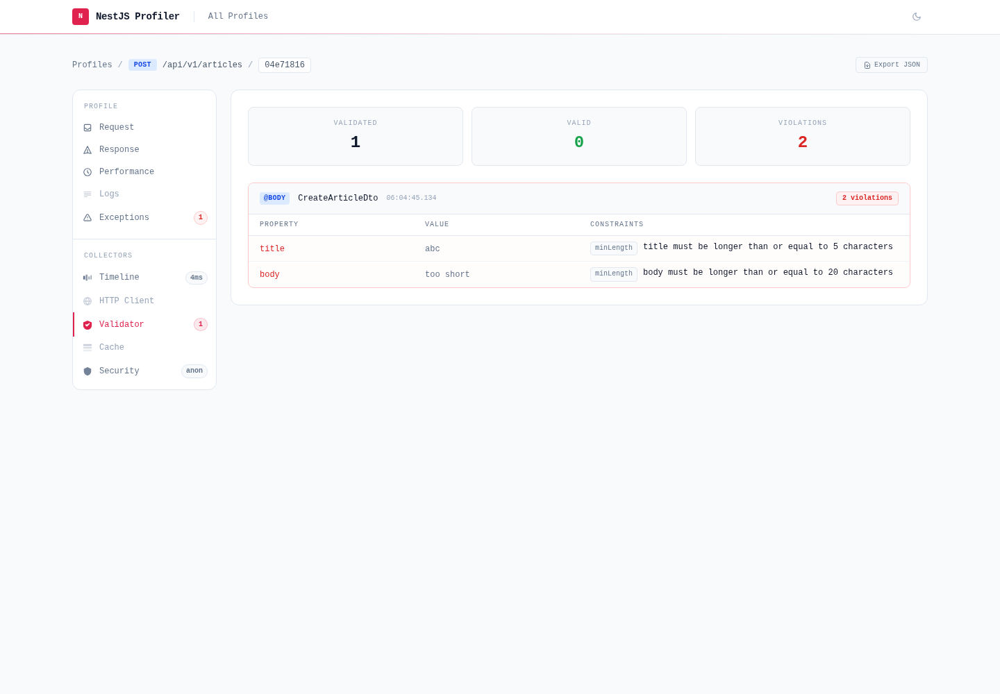
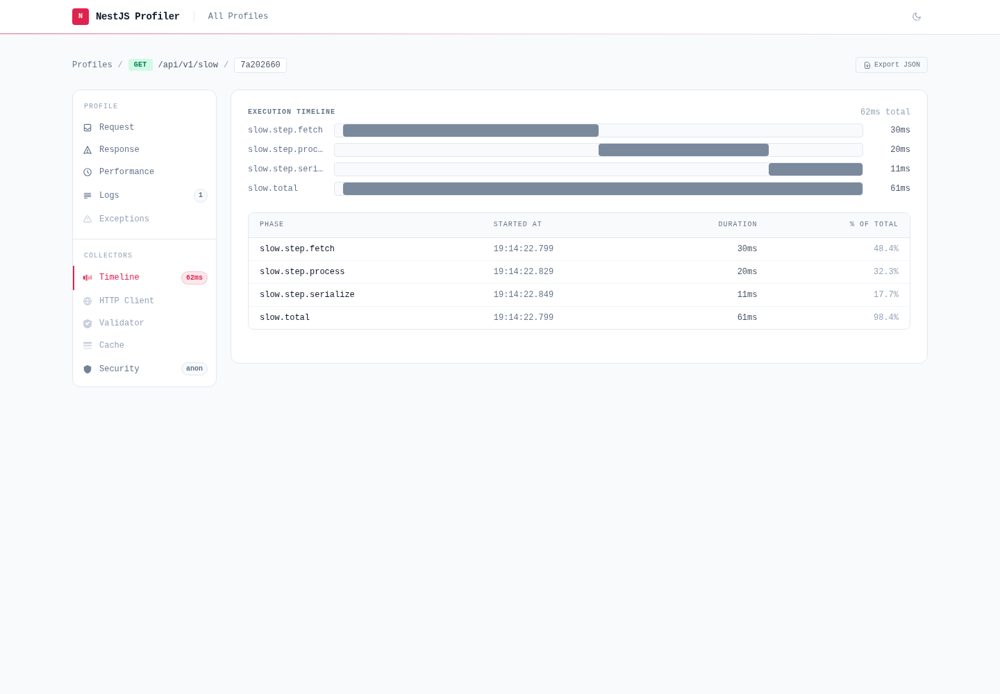

# nest-profiler

<p align="center">
  <a href="https://eleven-labs.com">
    <picture>
      <source media="(prefers-color-scheme: dark)" srcset="assets/eleven-labs-white.svg">
      
    </picture>
  </a>
</p>

<p align="center"><em>Powered &amp; maintained by <a href="https://eleven-labs.com">Eleven Labs</a></em></p>

<p align="center">
  <a href="https://github.com/eleven-labs/nest-profiler/actions/workflows/ci.yml"></a>
  <a href="https://github.com/eleven-labs/nest-profiler/actions/workflows/quality.yml"></a>
  <a href="https://codecov.io/gh/eleven-labs/nest-profiler"></a>
  <a href="LICENSE"></a>
</p>

<p align="center">
  <a href="https://nest-profiler.eleven-labs.com"></a>
  
  
  
  
</p>

<p align="center">
  <a href="https://conventionalcommits.org"></a>
  <a href=".github/dependabot.yml"></a>
  <a href="CONTRIBUTING.md"></a>
</p>

A **Symfony Web Profiler-inspired** toolkit for NestJS applications. Each profiled execution receives a unique token, and a rich panel UI at `/_profiler` lets you inspect request data, logs, exceptions, performance spans, and much more — in real time.

The ecosystem is built around an **extensible collector architecture**: the core package provides the profiler engine, storage, and UI, while optional sub-packages each add a dedicated panel as a self-contained NestJS module.



## Packages

Each package is a self-contained NestJS module with its own README:

- [`@eleven-labs/nest-profiler`](packages/nest-profiler/README.md) — Core + Timeline panel
- [`@eleven-labs/nest-profiler-typeorm`](packages/nest-profiler-typeorm/README.md) — Database panel (TypeORM)
- [`@eleven-labs/nest-profiler-mikro-orm`](packages/nest-profiler-mikro-orm/README.md) — Database panel (MikroORM)
- [`@eleven-labs/nest-profiler-axios`](packages/nest-profiler-axios/README.md) — HTTP Client panel
- [`@eleven-labs/nest-profiler-cache`](packages/nest-profiler-cache/README.md) — Cache panel
- [`@eleven-labs/nest-profiler-auth`](packages/nest-profiler-auth/README.md) — Security panel
- [`@eleven-labs/nest-profiler-config`](packages/nest-profiler-config/README.md) — Config panel
- [`@eleven-labs/nest-profiler-mongoose`](packages/nest-profiler-mongoose/README.md) — Database (NoSQL) panel
- [`@eleven-labs/nest-profiler-validator`](packages/nest-profiler-validator/README.md) — Validator panel
- [`@eleven-labs/nest-profiler-commander`](packages/nest-profiler-commander/README.md) — Command panel (CLI / nest-commander)

Full guides and API reference live on the documentation site (`pnpm docs:dev`, then http://localhost:3002).

### Panels at a glance

|                                                                  |                                                                        |                                                                  |
| ---------------------------------------------------------------- | ---------------------------------------------------------------------- | ---------------------------------------------------------------- |
|  |  |        |
| **Database** (TypeORM)                                           | **HTTP Client** (Axios)                                                | **Cache**                                                        |
|  |      |  |
| **Security** (JWT/Auth)                                          | **Validator** (class-validator)                                        | **Timeline** (spans)                                             |

## Quickstart

Requirements: Node.js `22+`, pnpm `10+`

```bash
pnpm install        # install dependencies
pnpm build          # build all packages
pnpm test:cov       # run the test suite with coverage
pnpm docs:dev       # serve the documentation site at http://localhost:3002
```

To try the profiler against a real app, start the databases and the demo API, then open `http://localhost:3000/_profiler`:

```bash
pnpm docker:up      # Postgres + MongoDB (runs in the background)
pnpm example:dev
```

## Installation

Packages are published to the public **npm** registry — install them like any other dependency, no authentication required:

```bash
pnpm add @eleven-labs/nest-profiler nestjs-cls
```

```ts title="app.module.ts"
import { ProfilerModule } from '@eleven-labs/nest-profiler';

@Module({
  imports: [
    ProfilerModule.forRoot({
      isGlobal: true,
      enabled: process.env.NODE_ENV !== 'production',
    }),
  ],
})
export class AppModule {}
```

Add optional collectors in their respective feature modules:

```bash
pnpm add @eleven-labs/nest-profiler-typeorm
```

```ts title="products/products.module.ts"
import { TypeOrmCollectorModule } from '@eleven-labs/nest-profiler-typeorm';

@Module({
  imports: [TypeOrmCollectorModule.forRoot({ slowQueryThreshold: 50 })],
})
export class ProductsModule {}
```

## Repository Layout

A pnpm + Turbo monorepo. Publishable packages live under `packages/`; everything else supports them.

```text
packages/
  nest-profiler/            core profiler engine, storage, and UI
  nest-profiler-*/          optional collectors (typeorm, mikro-orm, axios, cache, auth, config, mongoose, validator, graphql, commander)
  configs/                  shared @repo/* tooling presets (eslint, jest, prettier, typescript)
examples/
  api/                      NestJS demo app with all collectors enabled
docs/                       Fumadocs documentation site
scripts/                    repository automation and release helpers
```

## Architecture

The profiler is a thin pipeline wired into the standard NestJS request lifecycle,
designed so that **collectors stay decoupled from the core** and **disabling the
profiler costs almost nothing**.

### Two layers: active and inert

`ProfilerModule.forRoot()` resolves `enabled` synchronously and registers one of
two layers:

- **Active** (default) — mounts the middleware, the global interceptor, the
  `/_profiler` controller, the collector registry and storage.
- **Inert** (`enabled: false`) — registers _only_ `ProfilerService`, as a no-op.
  It stays injectable everywhere, so application code that calls
  `profiler.startSpan(...)` or `profiler.createLogger(...)` keeps working with
  zero overhead and no conditional wiring on your side. Turn the profiler on in
  development and off in production with a single flag.

### Request lifecycle (HTTP)

```text
request
   │
   ▼
ProfilerMiddleware ── creates a Profile (unique token), stores it in the
   │                   request-scoped CLS context (nestjs-cls)
   ▼
route handler ──────── your code; collectors append entries into the active
   │                   Profile via CLS (SQL queries, HTTP calls, cache ops…)
   ▼
ProfilerInterceptor ── finalizes timing, runs CollectorRegistry.collectAll(),
   │                   lets context adapters enrich the Profile, persists it,
   │                   and injects the toolbar into HTML responses
   ▼
ProfilerStorageService → storage adapter (memory or file)
   │
   ▼
ProfilerController ─── serves the UI at /_profiler (list / detail / data),
                       protected by ProfilerGuard
```

The shared **CLS context** (`nestjs-cls`) is the backbone: the middleware puts
the `Profile` there, and everything downstream — collectors, the logger adapter,
`ProfilerService` — reads it back without threading the profile through method
signatures.

### Collectors

Each optional `@eleven-labs/nest-profiler-*` package is a self-contained NestJS
module that does two things:

1. **Patches its host library** (the TypeORM driver, the MikroORM logger, axios
   interceptors, the cache manager, `ValidationPipe`…) to append entries to the
   active profile. Patches are idempotent (`__profilerPatched`) so re-init never
   double-instruments.
2. **Exposes a panel** via a provider annotated with `@ProfilerCollector()`. The
   `CollectorRegistry` auto-discovers these through Nest's `DiscoveryService` —
   no manual registration — and calls each `collect()` to build its panel data.

This is the extension seam: a custom collector is just a provider implementing
`IProfilerCollector`. See [Custom collectors](packages/nest-profiler/docs/collectors.md#custom-collectors).

### Non-HTTP protocols

Protocols other than HTTP (GraphQL, gRPC, WebSockets…) are supported through
`IContextAdapter`: an adapter recovers and enriches the profile for its context
type, and the interceptor delegates to it automatically once it is registered via
the `PROFILER_CONTEXT_ADAPTERS` multi-token. See
[Custom protocol adapters](packages/nest-profiler/docs/context-adapters.md).

## Common Commands

Run a task across every package via Turbo:

```bash
pnpm lint           # eslint
pnpm typecheck      # tsc --noEmit
pnpm test           # run unit tests
pnpm test:cov       # run tests with coverage (enforces the 90% threshold)
pnpm build          # build all packages
pnpm docs:dev       # serve the docs site
pnpm docker:up      # start Postgres + MongoDB for the example (docker:down to stop)
pnpm attw           # check published type resolution (Are the Types Wrong?)
pnpm changeset      # record a version bump
```

Target a single package with `--filter`:

```bash
pnpm --filter @eleven-labs/nest-profiler test:cov
pnpm --filter @eleven-labs/nest-profiler-typeorm build
```

## Publishing

Packages are versioned with Changesets and released from CI to the public npm registry. The versioning policy (`0.x` rules, `ALLOW_MAJOR_BUMPS`), the stable release flow, and the alpha/beta prerelease runbook live in [MAINTAINERS.md](MAINTAINERS.md).
