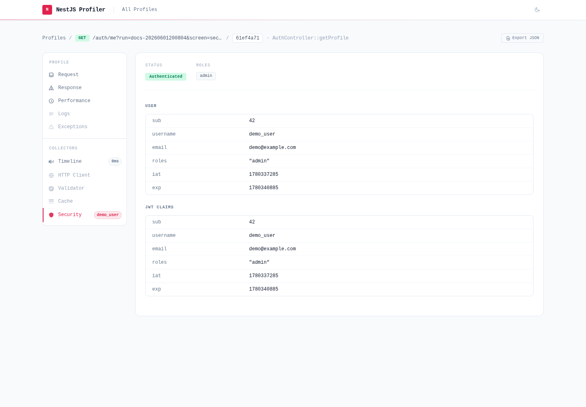

# @eleven-labs/nest-profiler-auth

`@eleven-labs/nest-profiler-auth` captures the authentication context (Passport user, JWT claims, roles) of the current execution and displays it in a **Security** panel.



## Installation

```bash
pnpm add @eleven-labs/nest-profiler-auth
```

No additional peer dependencies beyond `nestjs-cls` (already required by `@eleven-labs/nest-profiler`).

## Setup

```ts title="app.module.ts"
import { AuthCollectorModule } from '@eleven-labs/nest-profiler-auth';

@Module({
  imports: [
    ProfilerModule.forRoot({ isGlobal: true }),
    AuthCollectorModule.forRoot({
      maskUserFields: ['password', 'refreshToken'], // additional fields to mask
    }),
  ],
})
export class AppModule {}
```

## What it collects

| Field             | Description                                              |
| ----------------- | -------------------------------------------------------- |
| `isAuthenticated` | `true` when `request.user` is populated (Passport)       |
| `user`            | The `request.user` object (with sensitive fields masked) |
| `roles`           | `user.roles` or `user.role` (normalized to array)        |
| `jwtClaims`       | Decoded JWT payload from `Authorization: Bearer …`       |

**Automatic masking:** Fields matching `password|secret|key|token|credential` are replaced with `***`. Additional fields can be specified via `maskUserFields`.

Note: The JWT is decoded **without verification** (display only). Never rely on this data for security decisions.

## Toolbar badge

The authenticated user's identifier (`username`, `email`, `sub`, or `id`) or `anon` for unauthenticated requests.

## How it works

The collector reads `request.user` and the `Authorization` header from the current CLS context (set by the profiler middleware). It decodes the JWT payload using `Buffer.from(payload, 'base64url')` without any cryptographic verification.
