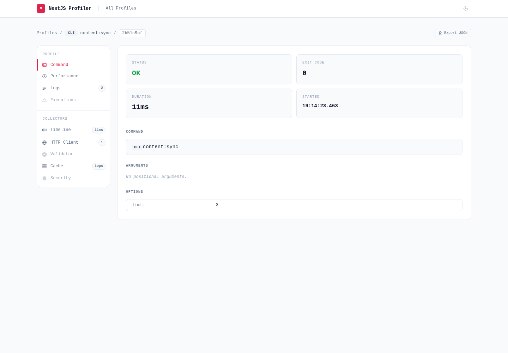

# @eleven-labs/nest-profiler-commander

`@eleven-labs/nest-profiler-commander` profiles CLI commands built with [nest-commander](https://nest-commander.jaymcdoniel.dev/) — the console equivalent of Symfony's command profiling. Every command run produces a profile that shows up in the web profiler at `/_profiler`, in a dedicated **Commands** table and with a built-in **Command** tab, plus any HTTP, cache, or database activity the command triggered.



## Installation

```bash
pnpm add @eleven-labs/nest-profiler-commander nest-commander
```

**Peer dependencies:** `nest-commander ^3.20.0`

## Setup

The collector wraps every discovered command automatically — you do not change your command classes. Register it in the module you bootstrap with `CommandFactory`:

```ts title="cli.module.ts"
import { Module } from '@nestjs/common';
import { ProfilerModule } from '@eleven-labs/nest-profiler';
import { CommanderCollectorModule } from '@eleven-labs/nest-profiler-commander';
import { AppCommand } from './app.command';

@Module({
  imports: [
    // File storage lets the CLI process and the HTTP server share profiles.
    ProfilerModule.forRoot({ isGlobal: true, storageType: 'file', storagePath: '.profiler' }),
    CommanderCollectorModule.forRoot(),
  ],
  providers: [AppCommand],
})
export class CliModule {}
```

```ts title="cli.ts"
import { CommandFactory } from 'nest-commander';
import { CliModule } from './cli.module';

async function bootstrap(): Promise<void> {
  await CommandFactory.run(CliModule, { logger: ['error', 'warn'] });
}

void bootstrap();
```

Run a command, then open `/_profiler` on your HTTP app (pointed at the same `storagePath`) to inspect it.

> **Cross-process storage required.** The CLI and the web server are separate processes, so command profiles are only visible in the server when both share the backing store — use `storageType: 'file'` (or a Redis/DB adapter). In-memory storage is per-process; the profiler logs a warning if you profile a command against it.

## What it collects

Each command run sets `request.command` on the profile:

| Field       | Description                                    |
| ----------- | ---------------------------------------------- |
| `name`      | Command name from `@Command({ name })`         |
| `arguments` | Positional parameters (`passedParams`)         |
| `options`   | Parsed flag options                            |
| `exitCode`  | `0` on success, `1` when the command threw     |
| `success`   | Whether the command completed without throwing |

Duration and timing come from the profile's standard performance data, and a thrown error appears in the **Exceptions** tab. Because the command body runs inside the profiler's CLS context, other collectors (e.g. `@eleven-labs/nest-profiler-axios`, `@eleven-labs/nest-profiler-cache`) capture the work a command performs and contribute their own panels.

## How it works

At application bootstrap the module discovers every provider that is an instance of nest-commander's `CommandRunner` and wraps its `run()` method. The wrapper synthesises a profile (`request.method = 'CLI'`, `request.url = '<command> <args>'`, and `request.command`), opens a CLS context, runs the original command, then runs all collectors and saves the profile through the profiler's shared storage. The profiler UI renders command profiles in a dedicated Commands table and a built-in Command tab — no extra setup in your HTTP app. `nest-commander` is an optional peer dependency: when it is not installed the module is a no-op.

---

Part of the [nest-profiler](https://github.com/eleven-labs/nest-profiler) toolkit · Powered & maintained by [Eleven Labs](https://eleven-labs.com)
