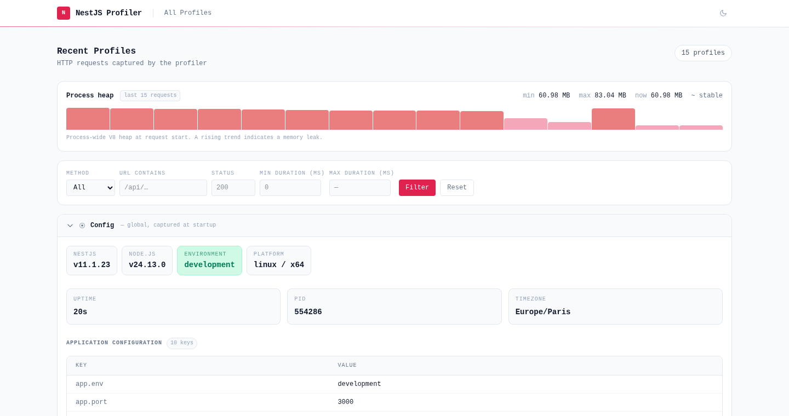

# @eleven-labs/nest-profiler-config

`@eleven-labs/nest-profiler-config` takes a snapshot of the application configuration at startup and displays it in a **Config** panel. Secret values are automatically masked.



## Installation

```bash
pnpm add @eleven-labs/nest-profiler-config @nestjs/config
```

**Peer dependencies:** `@nestjs/config ^4.0.0`

## Setup

```ts title="app.module.ts"
import { ConfigModule } from '@nestjs/config';
import { ConfigCollectorModule } from '@eleven-labs/nest-profiler-config';

@Module({
  imports: [
    ConfigModule.forRoot({ isGlobal: true }),
    ConfigCollectorModule.forRoot({
      maskKeys: ['DATABASE_URL', 'JWT_SECRET'], // additional keys to mask
    }),
    ProfilerModule.forRoot({ isGlobal: true }),
  ],
})
export class AppModule {}
```

## What it collects

The full configuration object (from `ConfigService`'s internal store), flattened to dot-notation keys:

```
db.host      = localhost
db.password  = ***
port         = 3000
NODE_ENV     = development
```

Nested objects are flattened with `.` separators.

## Automatic masking

Keys matching the pattern `/password|secret|key|token|credential|api_key|apikey/i` are automatically replaced with `***`. Additional keys can be specified via `maskKeys`.

## Toolbar badge

Number of configuration keys loaded (e.g., `12`).

## How it works

At `OnApplicationBootstrap`, the collector accesses `ConfigService`'s internal configuration store via `configService.internalConfig` (an internal property, not part of the public API). The snapshot is captured once at startup and returned for every profile — it does not re-read config on each execution.
