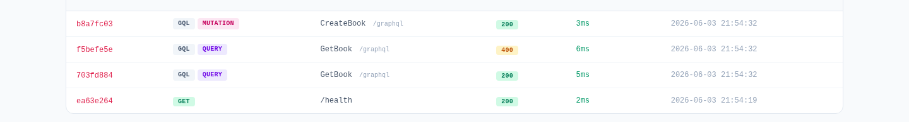
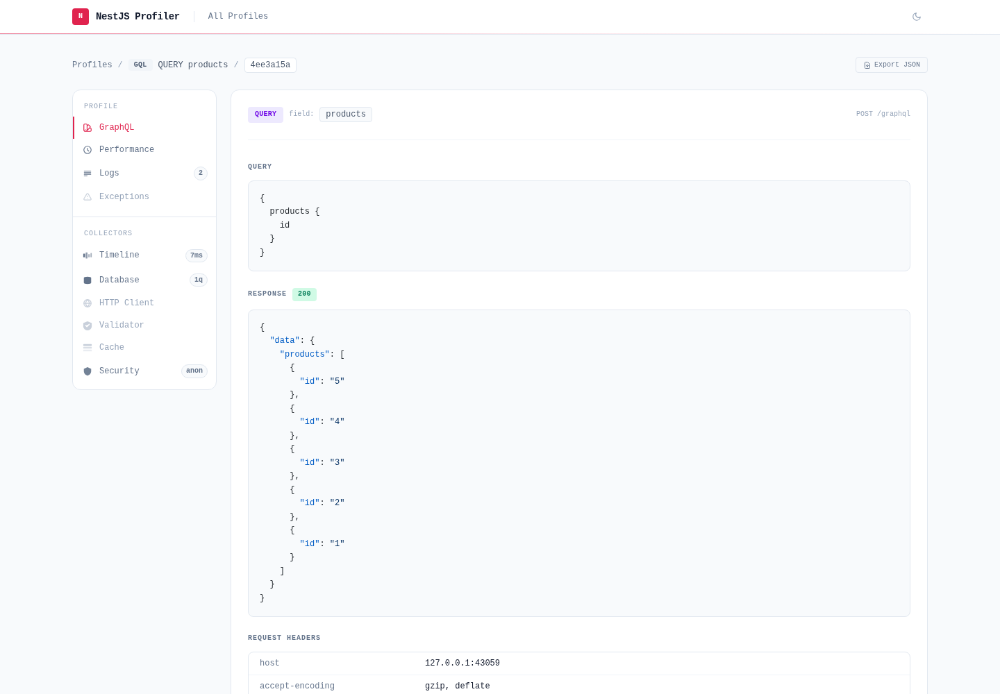
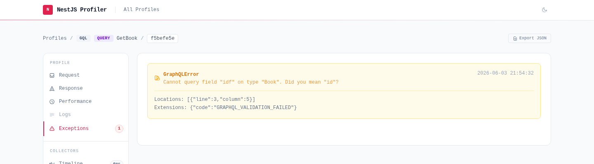

# @eleven-labs/nest-profiler-graphql

`@eleven-labs/nest-profiler-graphql` captures GraphQL queries and mutations and displays them in the profiler **Request** tab with a dedicated **GraphQL** section.





## Installation

```bash
pnpm add @eleven-labs/nest-profiler-graphql
```

## Setup

Import `ProfilerGraphQLModule` alongside `ProfilerModule` in your application module.

### Apollo Server (Express or Fastify)

```ts
import { ProfilerModule } from '@eleven-labs/nest-profiler';
import { ProfilerGraphQLModule } from '@eleven-labs/nest-profiler-graphql';

@Module({
  imports: [
    ProfilerModule.forRoot({ isGlobal: true }),
    ProfilerGraphQLModule.forRoot(),
    GraphQLModule.forRoot<ApolloDriverConfig>({
      driver: ApolloDriver,
      autoSchemaFile: true,
      // Required — exposes the Express/Fastify request so the profiler can
      // store and recover the profile across the async context boundary.
      context: ({ req }) => ({ req }),
    }),
  ],
})
export class AppModule {}
```

### Mercurius (Fastify)

```ts
(ProfilerGraphQLModule.forRoot(),
  GraphQLModule.forRoot<MercuriusDriverConfig>({
    driver: MercuriusDriver,
    autoSchemaFile: true,
    // Mercurius uses `request` instead of `req`
    context: ({ request }) => ({ request }),
  }));
```

### graphql-yoga (Express or Fastify)

```ts
(ProfilerGraphQLModule.forRoot(),
  GraphQLModule.forRoot<YogaDriverConfig>({
    driver: YogaDriver,
    autoSchemaFile: true,
    context: ({ req }) => ({ req }),
  }));
```

## Options

```ts
ProfilerGraphQLModule.forRoot({
  enabled?: boolean; // Default: true. Set to false to disable GraphQL profiling.
})
```

## Ignoring playground and introspection requests

The playground and introspection requests are profiled by default. Use the
`ignoreRequest` option of `ProfilerModule` together with the pre-built filters
from this package to exclude them:

```ts
import { ProfilerModule, combineFilters } from '@eleven-labs/nest-profiler';
import {
  ProfilerGraphQLModule,
  ignoreGraphQLPlayground,
  ignoreGraphQLIntrospection,
} from '@eleven-labs/nest-profiler-graphql';

ProfilerModule.forRoot({
  isGlobal: true,
  ignoreRequest: combineFilters(ignoreGraphQLPlayground, ignoreGraphQLIntrospection),
}),
ProfilerGraphQLModule.forRoot(),
```

| Filter                       | Skips                                                                                          |
| ---------------------------- | ---------------------------------------------------------------------------------------------- |
| `ignoreGraphQLPlayground`    | `GET /graphql` with `Accept: text/html` — the Sandbox UI page load                             |
| `ignoreGraphQLIntrospection` | Any POST with `operationName: IntrospectionQuery` or a query referencing `__schema` / `__type` |

## What is captured

Each profiled GraphQL request shows a **GQL** badge in `/_profiler` and records:

| Field           | Description                                    |
| --------------- | ---------------------------------------------- |
| `operationType` | `query`, `mutation`, or `subscription`         |
| `operationName` | Named operation (e.g. `GetBooks`), if provided |
| `fieldName`     | Entry-point resolver field                     |
| `query`         | The full GraphQL document (formatted)          |
| `variables`     | Variables object                               |

GraphQL-level errors (schema validation failures, resolver errors) appear in the **Exceptions** tab with an amber `GraphQLError` badge, distinct from NestJS runtime exceptions.



## How it works

`ProfilerGraphQLModule` registers `GraphQLContextAdapter` with `ProfilerCoreService` on module init. The adapter supports all NestJS GraphQL drivers that expose the HTTP request in the execution context:

- **Apollo** (Express / Fastify): looks for `gqlCtx.req`
- **Mercurius** (Fastify): looks for `gqlCtx.request`

A middleware `finish` hook also captures GraphQL errors for requests that Apollo handles without calling any resolver (e.g. schema validation failures), ensuring those profiles still appear in `/_profiler`.

## Custom protocol adapters

This package is the reference implementation of the `IContextAdapter` pattern from `@eleven-labs/nest-profiler`. You can use the same pattern to profile gRPC, Kafka, WebSockets, or any other NestJS execution context — see the [`@eleven-labs/nest-profiler` documentation](../nest-profiler/README.md#custom-protocol-adapters) for a full example.

---

Part of the [nest-profiler](https://github.com/eleven-labs/nest-profiler) toolkit · Powered & maintained by [Eleven Labs](https://eleven-labs.com)
