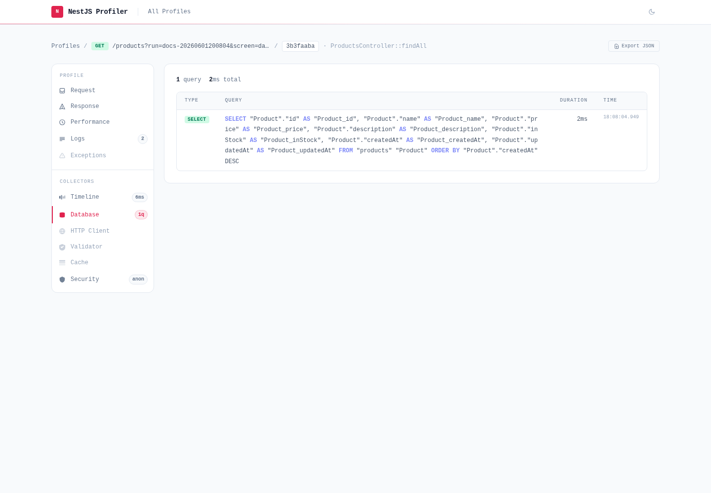

# @eleven-labs/nest-profiler-mikro-orm

`@eleven-labs/nest-profiler-mikro-orm` captures every SQL query executed by [MikroORM](https://mikro-orm.io) during a profiled execution and displays them in a dedicated **Database** panel.



## Installation

```bash
pnpm add @eleven-labs/nest-profiler-mikro-orm
```

**Peer dependencies:** `@mikro-orm/core ^7.0.0`, `@mikro-orm/nestjs ^7.0.0`

## Setup

Register `MikroOrmCollectorModule` **after** `MikroOrmModule` in your root module. No extra MikroORM
configuration is required — the collector wraps the ORM logger automatically:

```ts title="app.module.ts"
import { Module } from '@nestjs/common';
import { MikroOrmModule } from '@mikro-orm/nestjs';
import { PostgreSqlDriver } from '@mikro-orm/postgresql';
import { MikroOrmCollectorModule } from '@eleven-labs/nest-profiler-mikro-orm';

@Module({
  imports: [
    MikroOrmModule.forRoot({
      driver: PostgreSqlDriver,
      // ...your connection options
    }),
    MikroOrmCollectorModule.forRoot({
      slowQueryThreshold: 100, // ms — queries above this are highlighted (default: 100)
    }),
  ],
})
export class AppModule {}
```

## What it collects

For each SQL query executed during a request:

| Field        | Description                                        |
| ------------ | -------------------------------------------------- |
| `sql`        | The SQL query string (with keyword highlighting)   |
| `parameters` | Bound parameters                                   |
| `duration`   | Execution time in ms (from MikroORM's `took`)      |
| `type`       | `SELECT`, `INSERT`, `UPDATE`, `DELETE`, `OTHER`    |
| `isSlow`     | `true` if duration ≥ `slowQueryThreshold`          |
| `startedAt`  | Unix timestamp                                     |
| `error`      | Set when MikroORM reports the query at error level |

Slow queries are highlighted in red in the panel.

## Toolbar badge

The toolbar badge shows: `{n}q` (e.g., `5q`). When slow queries are present: `5q (2 slow)`.

## How it works

The collector wraps MikroORM's `Logger.logQuery` at module initialization (`OnModuleInit`).
MikroORM's SQL connection always measures execution time and calls `logQuery` with the query, its
parameters and the elapsed `took`; the collector pushes a query entry into the active request
profile (resolved via [`nestjs-cls`](https://github.com/Papooch/nestjs-cls)) and lets the original
logger handle console output only if you had query logging enabled. Queries executed outside a
request context (startup, background jobs) are silently ignored.

This captures all queries issued through the `EntityManager`, repositories and the QueryBuilder.

---

Part of the [nest-profiler](https://github.com/eleven-labs/nest-profiler) toolkit · Powered & maintained by [Eleven Labs](https://eleven-labs.com)
