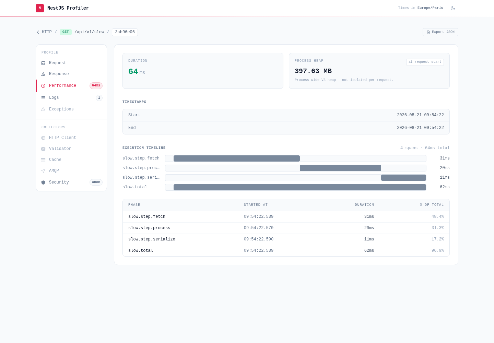

Collectors are the units that turn an execution into panels: each active collector contributes one tab to the profile detail view. Custom spans are captured by the profiler itself and shown in the built-in **Performance** tab, and any provider can become a collector with the `@ProfilerCollector()` decorator — this page covers both.

## Timeline spans

Instrument any code with `startSpan()` to capture custom timing data. The spans appear as an **Execution timeline** in the profile's **Performance** tab, alongside the request duration and the process heap:

```ts
import { ProfilerService } from '@eleven-labs/nest-profiler';

@Injectable()
export class UserService {
  constructor(private readonly profiler: ProfilerService) {}

  async findAll() {
    const stop = this.profiler.startSpan('db.findAll');
    const users = await this.userRepository.find();
    stop();
    return users;
  }
}
```

Span capture is always active; the timeline renders the spans as synchronized bars plus a per-phase table. A profile that recorded no span simply shows no timeline — there is no empty panel to dismiss.



## Custom collectors

Annotate a provider with `@ProfilerCollector()` to automatically add a custom data panel to every profile. The collector is auto-discovered via NestJS `DiscoveryModule` — no manual registration required.

```ts
import { Injectable } from '@nestjs/common';
import { ProfilerCollector, IProfilerCollector, Profile } from '@eleven-labs/nest-profiler';
import * as path from 'path';

const MY_ICON = `<svg viewBox="0 0 16 16" fill="currentColor">...</svg>`;

@Injectable()
@ProfilerCollector({
  name: 'myCollector',
  label: 'My Collector',
  icon: MY_ICON,
  priority: 50,
})
export class MyCollector implements IProfilerCollector {
  readonly name = 'myCollector';
  readonly label = 'My Collector';
  readonly icon = MY_ICON;
  readonly priority = 50;

  getBadgeValue(profile: Profile): string | null {
    // Return a value to display as a badge in the toolbar
    return '42';
  }

  getTemplatePath(): string {
    // Optional: path to a custom EJS panel template
    return path.join(__dirname, 'templates', 'my-collector-panel.ejs');
  }

  collect(profile: Profile): unknown {
    // Return any serializable data for this panel
    return { items: [] };
  }
}
```

Register the collector as a provider in your module — the profiler discovers it automatically at startup.

## Global-scope collectors

A collector describing the **application** rather than one execution declares `scope: 'global'`. It runs once per home-page render and becomes a sidebar view instead of a profile tab — that is how the Config, Schemas and Discover views are built. Its count badge is read from the first `*Count` field its data exposes (`entityCount`, `routeCount`…).

Declaring `group` / `groupLabel` files the view under a sidebar heading, so several related views read as one family (`Schemas / TypeORM`, `Schemas / Mongoose`). Ungrouped views stay flat at the end of the sidebar.

A global collector whose snapshot really holds several independent subjects can split it with `expandGlobalPanels()` — one view per subject instead of one panel aggregating them. It receives the value `collect()` returned:

```ts
@Injectable()
@ProfilerCollector({
  name: 'queues',
  scope: 'global',
  group: 'queues',
  groupLabel: 'Queues',
  priority: 75,
})
export class QueuesCollector implements IProfilerCollector {
  readonly name = 'queues';

  collect(): unknown {
    return { queues: [{ name: 'emails', jobs: 12 }] };
  }

  expandGlobalPanels(data: unknown): GlobalPanelDescriptor[] {
    return (data as { queues: { name: string; jobs: number }[] }).queues.map((queue) => ({
      name: `queues-${queue.name}`, // the `?view=` key — keep it unique across every view
      label: queue.name,
      data: queue,
      badge: queue.jobs,
    }));
  }
}
```

The group, icon, template and priority come from the collector, so each descriptor only carries what differs. Returning an empty array hides the collector from the sidebar entirely — an installed package with nothing to show adds no empty view. That is exactly how `@eleven-labs/nest-profiler-routes` turns its route sources into one **Discover** view per transport.

## Custom EJS panel template

When `getTemplatePath()` is defined, the profiler renders your custom EJS template instead of the default JSON dump. The template receives:

| Variable       | Type                       | Description                   |
| -------------- | -------------------------- | ----------------------------- |
| `data`         | `unknown`                  | Value returned by `collect()` |
| `profile`      | `Profile`                  | The full request profile      |
| `panel`        | `CollectorPanelInfo`       | Panel metadata (name, label…) |
| `highlightSql` | `(sql: string) => string`  | SQL syntax highlighter        |
| `toJson`       | `(val: unknown) => string` | JSON formatter                |
| `isoDate`      | `(ts: number) => string`   | ISO date formatter            |
| `timeOnly`     | `(ts: number) => string`   | Time-only formatter           |

> **Step-by-step tutorial** — [Build a custom collector](https://nest-profiler.eleven-labs.com/docs/tutorials/custom-collector) walks through writing a collector, its EJS panel and its badge from scratch.
