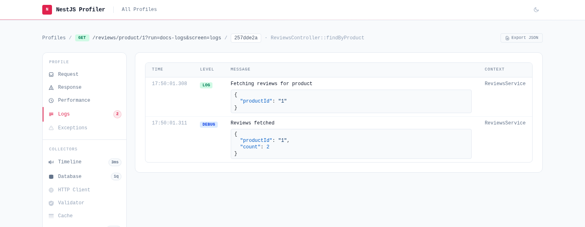

`@eleven-labs/nest-profiler` captures logs per execution: every entry written while a request (or CLI command) is being handled lands in that profile's **Logs** tab. The capture is a transparent proxy around your existing logger — it is **logger-agnostic** and works with NestJS's `ConsoleLogger`, `nestjs-pino`, `nest-winston` or any custom `LoggerService`.



## Enable log capture

Wrap the application logger with `profilerService.createLogger()` in `main.ts`:

```ts
import { ConsoleLogger } from '@nestjs/common';
import { NestFactory } from '@nestjs/core';
import { ProfilerService } from '@eleven-labs/nest-profiler';
import { AppModule } from './app.module';

async function bootstrap() {
  const app = await NestFactory.create(AppModule, { bufferLogs: true });

  const profilerService = app.get(ProfilerService);
  app.useLogger(profilerService.createLogger(new ConsoleLogger('MyApplication')));

  await app.listen(3000);
}

void bootstrap();
```

The wrapper returns the **same type** as the logger you pass in: it captures the level methods and forwards everything else, so the original logger keeps working exactly as before.

### Capturing a directly-injected logger

`app.useLogger()` only routes logs that go through NestJS's `Logger`. A logger **injected directly** (e.g. `nestjs-pino`'s `PinoLogger`) bypasses it — wrap that instance too:

```ts
constructor(
  profiler: ProfilerService,
  @InjectPinoLogger(MyService.name) pinoLogger: PinoLogger,
) {
  // pino's own `info()` keeps working AND is now captured into the profile
  this.logger = profiler.createLogger(pinoLogger);
}
```

## What a log entry contains

Each captured call is stored as a [`LogEntry`](https://nest-profiler.eleven-labs.com/docs/api-reference/nest-profiler#logentry):

- `level` — profiler level (`log`, `warn`, `error`, `debug`, `verbose`, `fatal`), mapped from the method name.
- `message` — the human-readable text.
- `context` — the logger context **name**, e.g. the class name passed to `new Logger(...)` or `setContext()`.
- `data` — the structured **payload** extracted from the call arguments, rendered as a JSON block in the UI.
- `timestamp` — when the call happened.

`context` and `data` are two different things: the first tells you _who_ logged, the second carries _what_ was logged alongside the message.

## Supported call conventions

Loggers disagree on argument order. The default parser classifies the common conventions automatically.

### Message first

The most common style — the message comes first, optionally followed by a payload object and/or a context name:

```ts
logger.log('User created'); // message only
logger.log('User created', 'UsersService'); // trailing string → context name
logger.log('User created', { userId: 42 }); // object → data
logger.log('User created', { userId: 42 }, 'UsersService'); // payload + context name
```

The NestJS `Logger` facade appends the class name automatically, so inside a service `new Logger(UsersService.name)` + `this.logger.log('User created', { userId: 42 })` produces all three fields at once.

### Object first (pino)

pino and `nestjs-pino`'s `PinoLogger` put the merging object **before** the message:

```ts
logger.info({ userId: 42 }, 'User created'); // merging object → data, message second
logger.error(new Error('kaput')); // Error → data { name, message, stack }
logger.error(err, 'Payment failed'); // explicit message wins, err serialized as data
```

### How the context name is resolved

1. A trailing string argument is read as the context name (the NestJS convention) — unless the message contains printf tokens that consume it, or the string looks like a stack trace.
2. When the arguments carry no context name, the logger's own `context` property is used as a fallback. This is how a directly-injected `PinoLogger` shows the name given to `@InjectPinoLogger(MyService.name)`, and how `new ConsoleLogger('MyApplication')` names entries that bypass the facade.

> **Ambiguous calls** — a `(object, string)` call is inherently ambiguous between pino's `(mergingObject, message)` and a NestJS object-message followed by a context name; the pino interpretation wins. For a logger with a genuinely different convention, pass a custom [`parseArgs`](#custom-argument-parser).

## Edge cases handled

- **printf interpolation** — in `logger.log('%s did %d things', 'bob', 3, 'UsersService')` the two interpolation arguments are stored as `data` and never mistaken for a context name.
- **`error(message, stack, context)`** — the NestJS error contract is recognized: the stack string is stored as `data: { stack }`, not as the context name.
- **`Error` instances** — serialized as `{ name, message, stack }` wherever they appear in the arguments.

## Payloads are made JSON-safe

Before storage, `data` is sanitized so a log payload can never break profile persistence: circular references become `'[Circular]'`, `BigInt` and `Date` are converted to strings, `Map`/`Set` become entry arrays, and depth, item-count and string-length caps keep payloads bounded.

## Customize the capture

### Method → level map

The default mapping already knows the common third-party method names (pino's `info` → `log`, `trace` → `verbose`, …). Extend it for extra methods:

```ts
import { DEFAULT_LOG_METHODS } from '@eleven-labs/nest-profiler';

profiler.createLogger(myLogger, {
  logMethods: { ...DEFAULT_LOG_METHODS, silly: 'verbose' },
});
```

### Custom argument parser

For a logger whose argument convention the default heuristic cannot classify, provide a [`parseArgs`](https://nest-profiler.eleven-labs.com/docs/api-reference/nest-profiler#profilerloggeroptions) function returning the [`ParsedLogCall`](https://nest-profiler.eleven-labs.com/docs/api-reference/nest-profiler#parsedlogcall) to store:

```ts
profiler.createLogger(weirdLogger, {
  parseArgs: (method, args) => ({
    message: String(args[1]),
    data: args[0],
  }),
});
```

The default parser is exported as `parseLogArgs`, so a custom parser can delegate to it for the cases it does not override.

## In the profiler UI

The **Logs** tab lists entries chronologically with the message first, then the context name. When an entry carries `data`, the payload is rendered as a pretty-printed JSON block under the message.

> **Step-by-step tutorial** — [Log capture with context](https://nest-profiler.eleven-labs.com/docs/tutorials/log-capture) walks through wiring the capture with `ConsoleLogger`, then with `nestjs-pino`, and inspecting the result in the UI.
